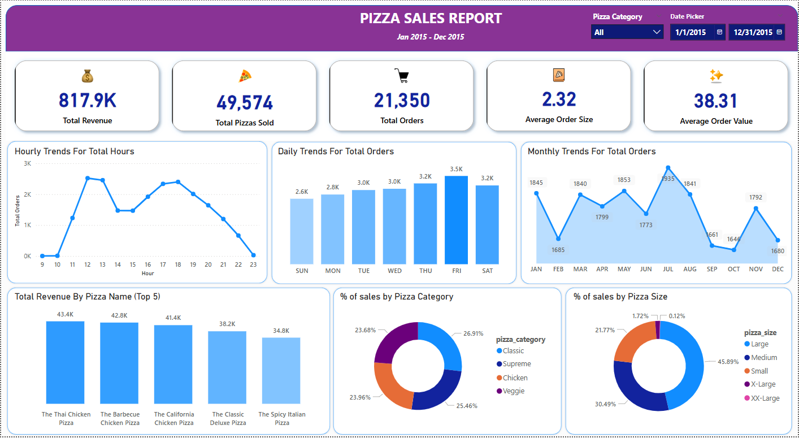
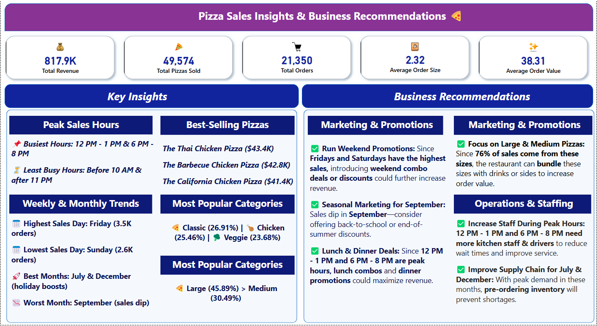

# 🍕 Pizza Sales Analysis | Data Analytics Project

This project analyzes **Pizza Sales Data** using **SQL, Excel, Power BI, and DAX functions** to uncover key insights and business trends. The dataset contains sales records from **Jan 2015 - Dec 2015**.

---

## 📊 **Project Highlights**

✅ **SQL Queries** – Data extraction, cleaning, and transformation  
✅ **Excel** – Data pre-processing & basic analysis  
✅ **Power BI** – Interactive dashboard using **DAX functions**  
✅ **Key Insights** – Sales trends, peak hours, top-selling pizzas

---

## 📊 **Dashboard Overview**

### 🖼 **Sales Trends & Insights**

### 📜 **Key Insights & Recommendations**

---

## 🔍 **Key Insights**

🔹 **Peak Sales Hours:** 12 PM - 1 PM & 6 PM - 8 PM  
🔹 **Best-Selling Pizzas:** Thai Chicken, Barbecue Chicken, California Chicken  
🔹 **Popular Pizza Sizes:** **Large (45.89%) > Medium (30.49%)**  
🔹 **Revenue Trends:** High sales in **July & December** (Holiday Effect)  
🔹 **Business Recommendation:** Focus on **large & medium pizzas**, run **weekend promotions**, and increase **staff during peak hours**

---

## 🛠 **Tools & Skills Used**

- **SQL (Joins, Aggregations, CTEs, Window Functions)**  
- **Excel (Data Cleaning, Pivot Tables, Analysis)**  
- **Power BI (DAX, Data Visualization, Dashboarding)**  

---

## 📢 **Connect With Me**

🔗 [LinkedIn](https://www.linkedin.com/in/tanzimrafat/)  
📧 Email: tanzimrafat069@gmail.com
